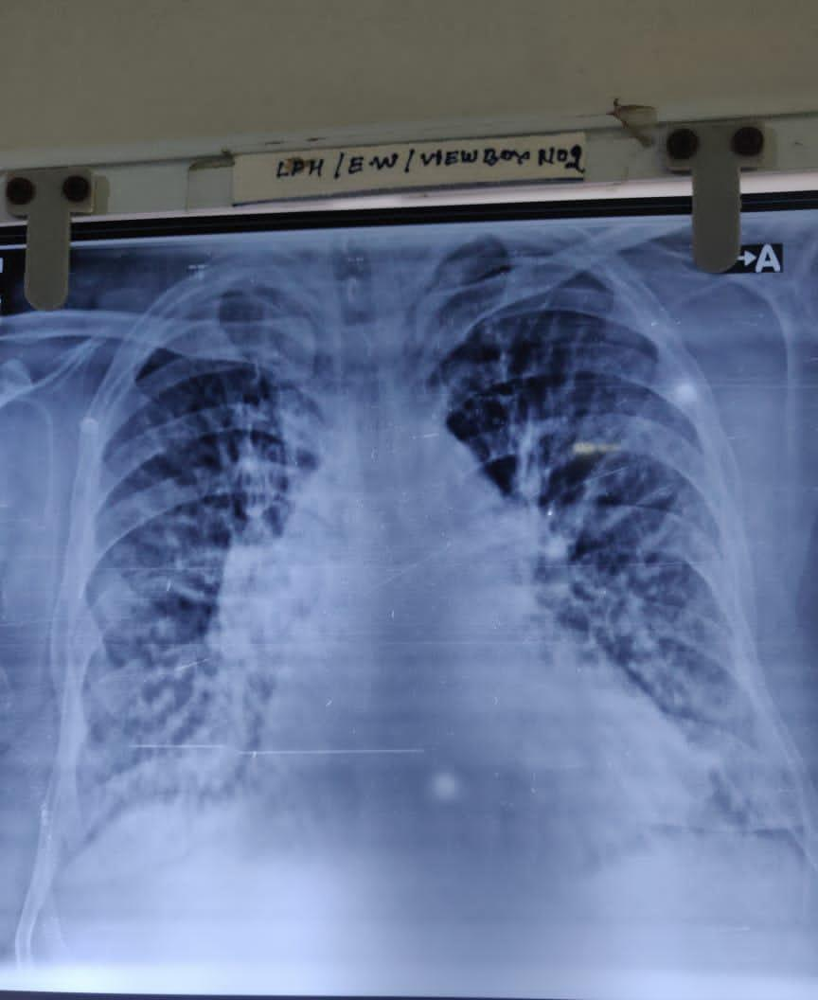

# Artificial Intelligence in Covid-19 Xray image diagnosis: Using Computer Vision

Read the paper [Covid-19 Paper](https://github.com/Arnold-Caleb/arnold-caleb.github.io/blob/master/Covid-19%20Paper.pdf) to get an insight into what was done during this research.

The model built from the research has so far been able to correctly diagnose a patient in Mulago Grade B Hospital.

## Dataset Size

For the research, 4044 Covid-19 images and 5500 Non-Covid19 images were used to train the computer vision model. Each image is labeled 0 (Covid-19 Xray) or 1 (Non-Covid-19 Xray).

## Methods

### Preprocessing
Preprocessing techniques used in the ResNet50 architecture.

### Data Augmentation
Cropping of images, rotating, flipping and addition of random small amount of Gaussian noise added to each pixel value.

### Network Architectures
ResNet50 network architecture was used as the base architecture of training the model.

## Results
```markdown
Final training Accuracy: **96.68%**
Final validation Accuracy: **90.62%**
Test dataset Accuracy: **87.23%**
```

Covid-19 Xray from Mulago Grade B Hospital



For more details see [GitHub Flavored Markdown](https://guides.github.com/features/mastering-markdown/).

### Support or Contact

